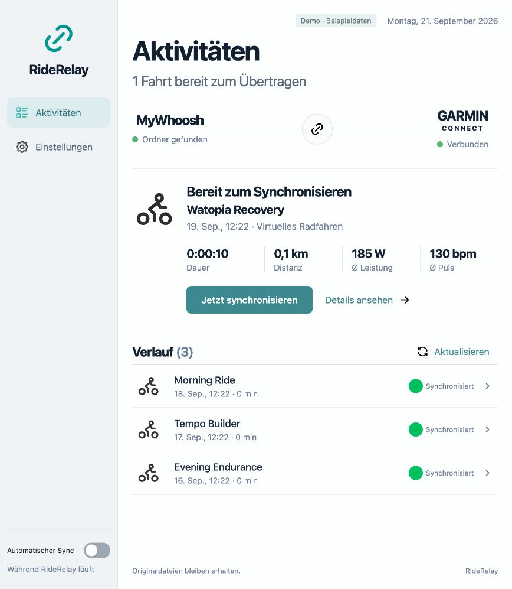

# RideRelay

Back up your MyWhoosh rides locally and sync them to Garmin Connect. Available
as a native desktop app and a CLI, with a shared Deno core for activities,
history and settings.



_The app showing sample data._

## Getting started

Download the desktop app from
[GitHub Releases](https://github.com/moxus/RideRelay/releases). On macOS,
extract the ZIP and move RideRelay.app to Applications. On Windows, run the MSI
installer. Sign in to Garmin under **Settings** and select your MyWhoosh folder.

To run from source, install Deno 2.9.7 or a compatible version. On macOS:
`brew install deno`.

```sh
deno task preview          # isolated sample data at http://127.0.0.1:4187
deno task desktop          # use real local data in the browser
deno task cli --help
deno task cli login        # hidden password and MFA prompts in the terminal
deno task cli reconcile    # check uncertain uploads against Garmin; no uploads
deno task cli scan         # discover and back up original files; no uploads
deno task cli sync --dry-run
deno task cli sync         # upload all ready activities
deno task cli watch        # sync new rides until Ctrl+C
```

The demo uses sample data and never uploads rides to Garmin.

```sh
deno task cli settings --source /absolute/MyWhoosh/folder --backup /absolute/backup/folder
deno task build:cli        # dist/riderelay
deno task build:desktop    # dist/RideRelay.app on macOS
```

`deno desktop` is experimental. The browser version uses the same local server
as the native app. Automatic desktop sync runs only while the app is open. The
CLI `watch` command syncs independently of the desktop app's automatic sync
toggle.

## Data and dependencies

- The only external runtime library is the official `@garmin/fitsdk@21.214.0`.
- A custom HTTP adapter handles Garmin login, MFA, session refresh, profile
  lookup and multipart uploads without a Garmin client library. Garmin's
  unofficial endpoints may change.
- Deno provides tasks, tests, formatting, package resolution and executable
  builds.
- SQLite uses Deno's `node:sqlite`; no separate database installation is needed.
- On macOS, settings are stored in
  `~/Library/Application Support/RideRelay/settings.json`, with history in
  `sync.sqlite` in the same directory. Windows uses `%LOCALAPPDATA%/RideRelay`.
- Session tokens are stored in macOS Keychain or Windows Credential Manager.
  Passwords are not saved. Linux does not currently have a production token
  store.
- Original FIT files are backed up unchanged under their SHA-256 hash before
  upload. The backup folder must be on a filesystem that supports hard links.
- `--data-dir` isolates settings and history. The production Garmin session is
  shared across the app; `--demo` uses an internal test adapter only.

File hashes and activity identity prevent duplicate discovery. Atomic SQLite
claims prevent the CLI and desktop app from uploading the same ride
concurrently. Known temporary failures may be retried a limited number of times.
An interrupted or unconfirmed upload remains **uncertain** until checked against
Garmin and is never automatically uploaded again. After a process stops
unexpectedly, an unfinished upload is marked uncertain once its ten-minute claim
expires.

RideRelay does not automatically repair FIT files. Damaged files remain visible
in history and are not uploaded. Existing backups are not overwritten. Source
files and backups are never automatically deleted.

## Development and testing

```sh
deno task check
deno task lint
deno task test
deno task fmt --check
```

The workspace contains `packages/core`, `packages/garmin`, `packages/contracts`,
`apps/shared`, `apps/cli` and `apps/desktop`. The API listens on loopback only
and uses origin/host checks and a custom request header to block requests from
other websites. FFI access is required for the native credential store. Desktop
helpers use subprocesses for folder selection, opening files and links, and
notifications.

Automated tests cover FIT parsing, backups, persistence, deduplication,
concurrent uploads, Garmin authentication and error handling, local API access
controls, and language selection. Native credential stores are checked using
disposable test data. Real Garmin uploads are not part of automated tests.

## macOS package

`deno task package:mac` creates `dist/RideRelay.dmg` for the build machine's
architecture. Open the DMG and drag RideRelay to Applications. Settings, history
and Keychain entries remain separate from the app bundle.

The package is ad hoc signed and is not notarized. Apple Developer ID signing
and notarization are needed to avoid the usual macOS trust warnings. Building a
local package does not publish it.

## Windows package (test version)

`deno task package:windows` creates `dist/RideRelay-windows-x64.msi`, including
when built from a Mac. The MSI installs the x64 app. Microsoft WebView2 must be
available on the target machine. The package is not signed with a Windows
publisher certificate.

GitHub Actions checks the build, CLI and Credential Manager on Windows. Manual
desktop installation testing is still pending. Before a stable release, startup,
folder selection, login/MFA, token storage limits, session recovery and sync
need to be verified interactively on Windows. Select the actual MyWhoosh data
folder in Settings if the default location does not match your installation.

## GitHub builds and releases

GitHub Actions checks every push and pull request using Deno 2.9.7 on macOS and
Windows, then builds the CLI and desktop packages. The Windows job also checks
Credential Manager with disposable synthetic data. Builds do not require Garmin
credentials.

Under **Actions → Build and release**, the Apple Silicon app ZIP and Windows x64
MSI are available as build artifacts for 14 days. Pushing a version tag such as
`v0.1.0` automatically publishes a **pre-release** under **Releases** after both
builds pass, with downloads and SHA-256 checksums. Release downloads remain
available beyond the build artifact retention period. Version tags must not be
moved; fixes receive a new version.

Packages currently lack trusted publisher signatures, and the macOS app is not
notarized. Native builds and credential-store checks do not replace manual
desktop installation testing.

The macOS app is distributed as a ZIP on GitHub because disk-image creation has
been unreliable on GitHub's macOS runners. Local DMG creation remains available
through `deno task package:mac`.

## Language

Under **Settings → Language**, choose **System language**, **Deutsch** or
**English**. RideRelay uses English for system languages other than German. Your
selection is saved and also applies to the CLI. Dates and numbers follow the
selected language; activity names and file paths are not translated.

```sh
deno task cli status --language en       # English for this invocation only
deno task cli settings --language de     # save German as the preferred language
deno task cli settings --language auto   # follow the system language again
```

`--json` keeps the same field names and status values regardless of language.
Translations are defined in `apps/shared/i18n.js` without an additional library.
Unrecognized system diagnostics are displayed unchanged.
